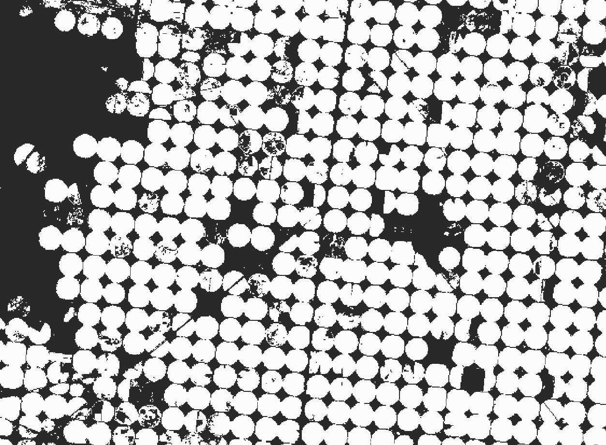
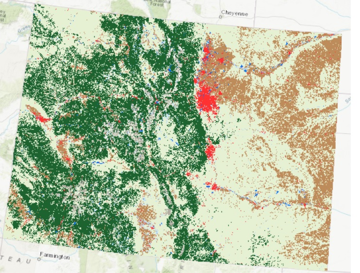

# Beaver_project
A repository containing automated codes to enhance the predicted wetland maps for Colorado.

- [Overview](#Overview)

- [Masks](#Masks)
  * [CropDataLayer](#CropDataLayer)
  * [LCMAP](#LCMAP)
- [Reprojection](#re-projection)
- [Filter](#filter-algorithm)


## Overview
Here we use different post processing techniques to improve the segmentation wetland maps for Colorado. We use datasets like CropDataLayer and LCMAP to filter the maps based on our purpose. After downloading each dataset, we reclassify them and make a probability mask from the dataset. We then re project the probability mask to have the same projection as the input segmentation.  The last algorithm reads the data from S3 bucket and clips back tiles. Then it crops and resamples the mask based on the tile information. In the next step, the algorithm reclassify each class (make them binary) and then filter the tile based on the provided masks. At the end, it uses the majority filter to remove small polygons, resamples the tile (to 2.4 m resolution) and saves the tile on S3 bucket.
## Masks

#### CropDataLayer

> You can open the terminal and  enter the following command in the prompt for reclassifying the [CDL data](https://nassgeodata.gmu.edu/CropScape/) into: 1. Crops and 2. No crops.
```shell
python ./path_to_file.py /path_to_raster.tif  /path_to_destination.tif
```
Where:

**./path_to_file.py** is the path to where you saved your .py file.

**/path_to_raster.tif** is the path to where you saved your raster file.

**/path_to_destination.tif** is the path to where you want to save your new file.



> You can use the following prompt to create a probability raster:

```shell
python ./path_to_file.py /path_to_destination.tif
```
Where:

**./path_to_file.py** is the path to where you saved your .py file.

**/path_to_destination.tif** is the path to where you want to save your new file.

#### LCMAP
> Download data from [Land Change Monitoring, Assessment, and Projection](https://www.usgs.gov/special-topics/lcmap/lcmap-data-access). To use the modified usgs code:

```shell
python ./path_to_file.py /path_to_shapefile.shp 'Cu or HI'
```
Where:

**./path_to_file.py** is the path to where you saved your .py file.
**/path_to_destination.tif** is the path to where you want to save your new file.
**'Cu or HI'** is your region of interest,'CU' for Conterminous US or 'HI' for Hawaii

The image below shows the LCMAP for Colorado for 2012:



For reclassifying and making a probability raster, you can use the same code that used for the previous section. Then you can use Multiple_bands.ipynb file to have one probability mask with different bands.


## Re projection
Run the 'Reprojection.ipynb' to change the projection of your mask into the new projection.

## Filter Algorithm
Modules of this algorithm are located in post_proc folder. Run the 'Filter.ipynb' to clip back the tiles, filter them with CDL and LCMAP masks, and save them on S3 bucket with 2.4 m resolution. 
The image below compares the original segmentation with the new tile after post processing:


